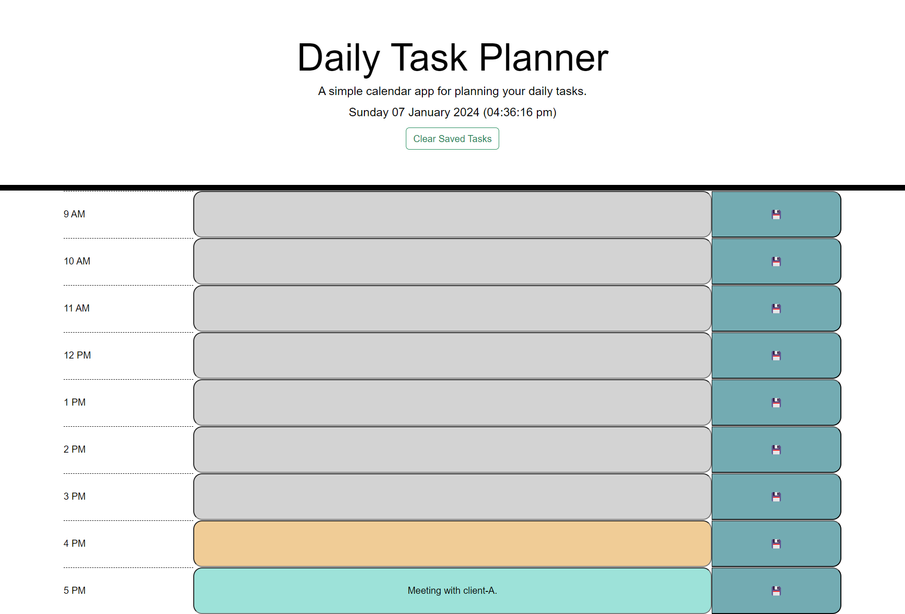

# Daily Task Planner

## Description

The aim of this project was to build a simple calendar application, which allows the user to save tasks to each hour of the day.

The project specified that the application should run in the browser and include `html` and `css` that is updated dynamically by `jQuery`, as well as make use of the `Day.js` library.

The project criteria further specified that the current date should be displayed at the top of the page and that the calendar should be made up of hourly blocks, covering a typical working day (i.e. 9am to 5pm). Moreover, each block should be colour-coded according to the current time (i.e. blocks in the past are colour-1, while the current block is colour-2 and any future blocks are colour-3).

When the user enters a task into the calendar and selects the adjacent save button, the project criteria stated that the task should save to the browser and that this task should persist between page refreshes (i.e. continue to be displayed on the calendar).

## Build

As per the project criteria, the application’s functionality has been built using `jQuery` and makes use of `Day.js` for working with date and time. Some of the application’s styling also relies upon `Bootstrap`.

The `javascript` file has been commented throughout with pseudocode, breaking the project into tasks, and comments have also been added to explain the functionality of the code.

The `html` and `css` files have been partially updated, and all changes to the starter code in these files have been noted in the code comments.

## Installation

N/A

## Usage

Users navigate to the webpage via the URL ([Daily Task Planner](https://code0em.github.io/daily-task-planner/)). When on the page, the header displays: the title, a brief description of the application, the current date and time, and a clear button. Beneath this, a calendar (made up of hourly blocks) is displayed. For each hourly block, an input field (for the user’s task) is displayed, as well as a corresponding save button.

When the user enters a task into the input field, the task is displayed on the calendar. Upon selecting the save button, the user’s task is saved to the browser and, subsequently, continues to be displayed between page refreshes.

If the user selects the clear button, any/all tasks are removed from the browser and, therefore, no longer displayed on the calendar.

On a resolution of 1400px, and at the time of 4.36PM with a task entered into the 5pm hourly block, the application will display the as follows:

## Credits

Credit given to edX (2023) for providing the application’s starter code, as well as to Xpert Learning Assistant (2024) which provided an answer to “how to check if keys have been stored in localStorage”. The code-block provided in the answer was adapted and used in the build (credit also cited in code comments).

Credit also given to MDN Web Docs (2023) (among others), whose pages built upon the developer’s existing knowledge of the methods used throughout the build (credits also cited in code comments).

All credits referenced below.

## Licence

Distributed under the MIT License. See `LICENSE.txt` for more information.

## Acknowledgments

Code written by Code0Em ([email](mailto:code.em@outlook.com)/ [GitHub](https://github.com/Code0Em)).

## References

edX (2023) [*Build new skills. Advance your career*](https://www.edx.org/).

HubSpot Blog (2023) [*11 Ways to Center a Div or Text in a Div in CSS*](https://blog.hubspot.com/website/center-div-css).

MDN Web Docs (2023) [*Element: previousElementSibling property*](https://developer.mozilla.org/en-US/docs/Web/API/Element/previousElementSibling).

W3Schools (no date) [*HTML Emojis*](https://www.w3schools.com/html/html_emojis.asp).

Xpert Learning Assistant (2024) (accessed via Virtual Learning Environment).
